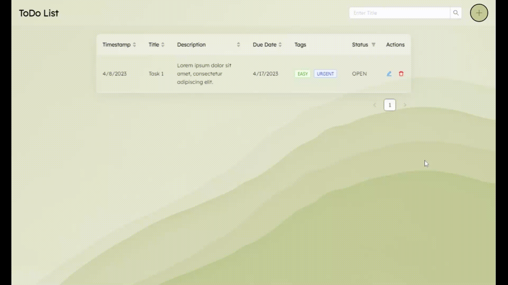

# React TODO App



This is a simple To-Do List app built using React. It allows users to perform CRUD operations.

## Installation

- Clone the repository to your local machine:

```bash
  git clone https://github.com/sanki92/todo-list-app.git
```

- Navigate to the todo-list-app directory:

```bash
  cd todo-list-app
```

- Install dependencies

```bash
  npm install
```

- Start the server

```bash
  npm run start
```

- Open the app in your browser at http://localhost:3000

# Project Structure

- **todo-list-app/**
  - **public/**
    - index.html
    - favicon.ico
    - manifest.json
  - **src/**
    - App.css
    - App.js
    - index.css
    - index.js

## Dependencies
The app uses the following dependencies:

- react: ^18.2.0
- react-dom: ^18.2.0
- react-scripts: 5.0.1
- moment: ^2.29.4
- antd: ^5.4.0
